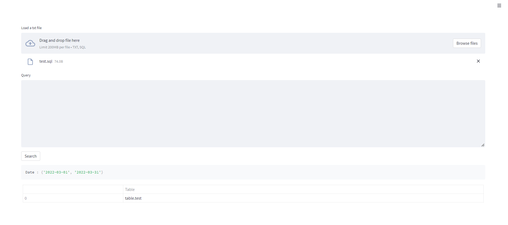

Query Hive Data from UI using Streamlit

Connection String
`presto.connect(host='Presto Host',port=PORT,username='USER_NAME')`
&nbsp;
&nbsp;

DB connection and Queried data are cached.

SQL queries can be uploaded as .txt / .sql formats or pasted in textarea.

Dates and Tables names will be displayed for reference.

&nbsp;

